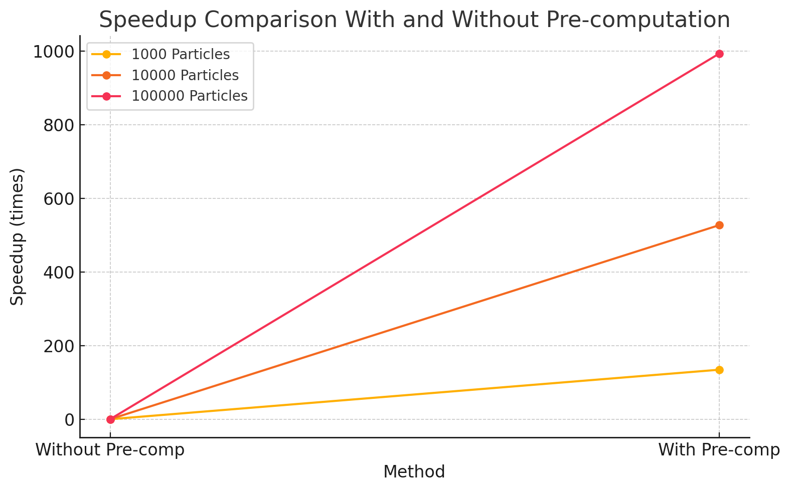
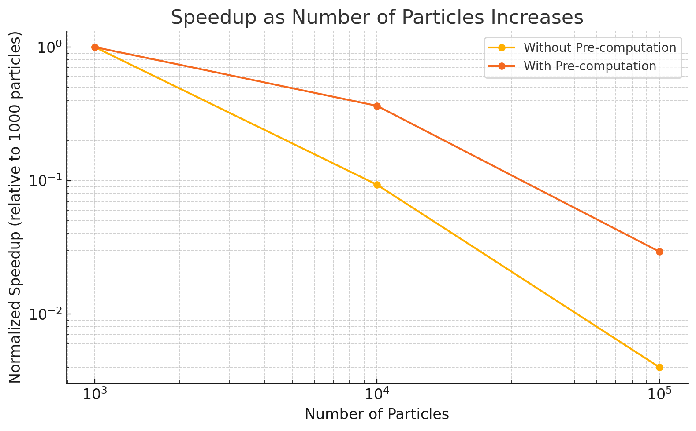
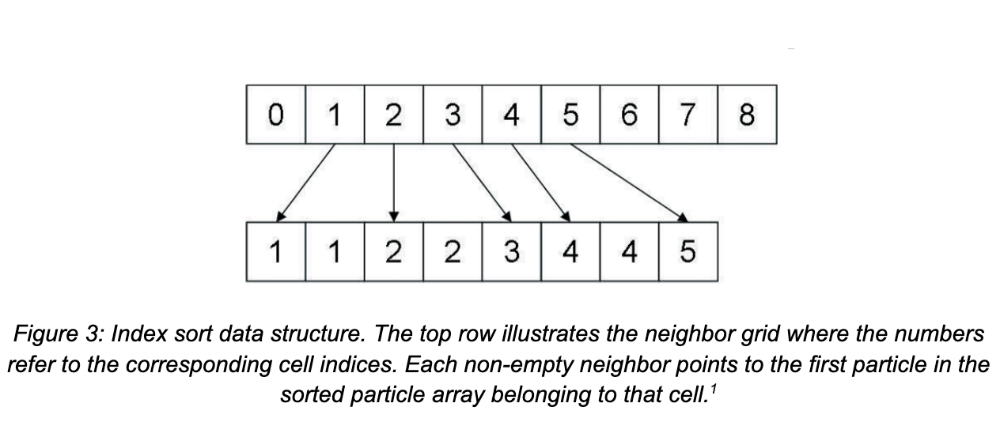
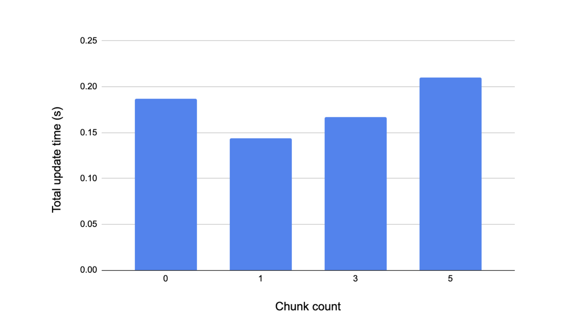
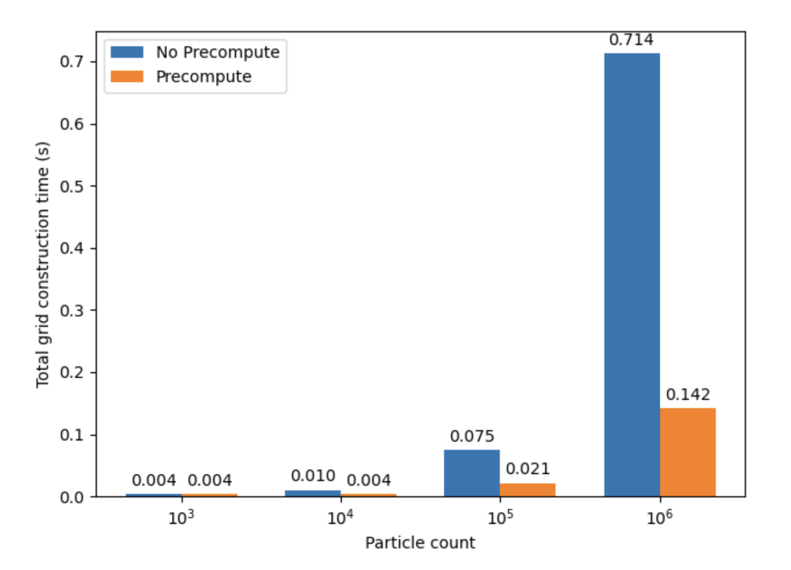
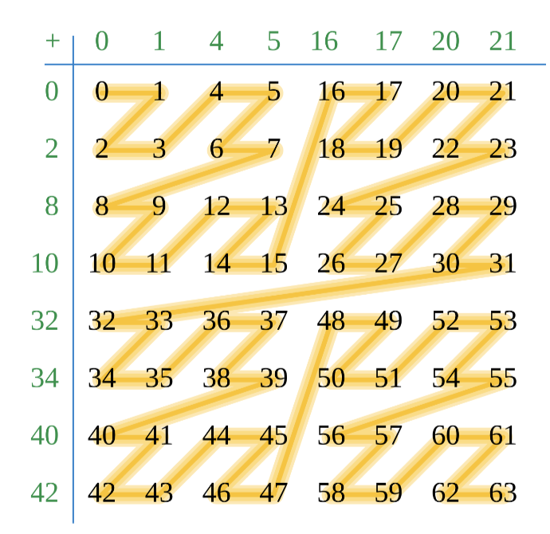
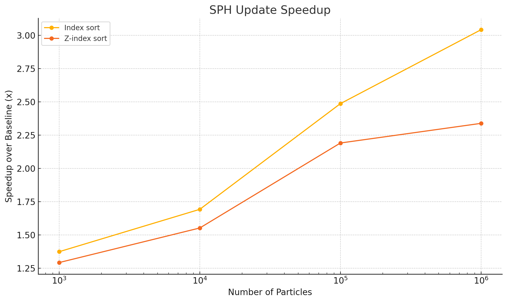
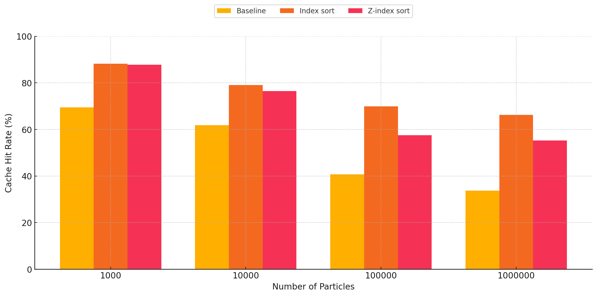
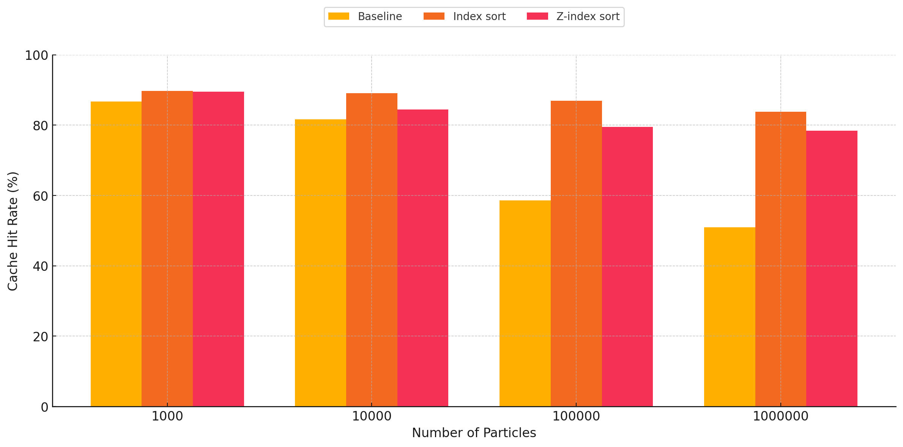
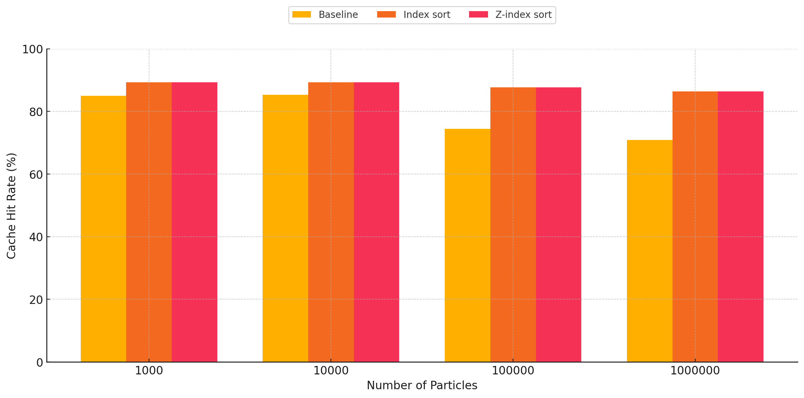

## Title: SPH Fluid Simulation in CUDA

### Summary
We implemented three versions of a smoothed-particle hydrodynamics (SPH) fluid simulation in CUDA, each using a different spatial data structure to accelerate the neighbor search step. We also applied various CUDA-specific optimizations on top of some of these base implementations, utilizing shared memory and precomputed values in constant memory for additional performance. Our fastest version is able to render one million particles at approximately 66 frames per second. Our simulator can be run with an OpenGL visualizer which renders the position of each particle at each timestep.

### Background
Simulating the physical behavior of fluids in real-time has a wide variety of use cases, though the complex interplay of various physical phenomena that occurs inside a real fluid makes the problem computationally difficult. One powerful technique that has emerged in this field is smoothed-particle hydrodynamics (SPH). In this model, the fluid is represented as a massive collection of free-moving particles, and the forces exerted on a given particle are approximated as a combination of the forces exerted by the particles in a nearby neighborhood defined by a radially-symmetric smoothing kernel. SPH provides an approximate numerical solution to the Navier-Stokes equations, and as such calculates the forces due to pressure, viscosity, and gravity at each timestep. Specifically, on a given time step, SPH involves the following set of calculations:

In the above pseudocode Wij represents the value of the smoothing kernel. There are various options for the specific function describing the kernel, but for the purpose of SPH simulation they all adopt a finite support _h_, meaning that they output 0 whenever the inputted pair of particles _i_ and _j_ are farther than _h_ units apart. 

For some fixed number of particles, the algorithm selects an initial position for each particle, and then performs the above computations on each particle. In particular, density and pressure at each particle are calculated, these values are then used to calculate the forces at each particle, and these forces are used to update the velocity and thus positions of each particle. This 3-part computation is repeated for an arbitrary number of timesteps, and particles can be rendered based on their positions at the end of each timestep. Note that in the above pseudocode, particle velocities and positions are updated using a simple forward Euler step with a fixed time step size. Other more stable numerical integration methods can be applied, though our project was able to achieve sufficiently stable simulation results using this method. Also note that our simulator bounds all particles inside a cube-shaped box, and simple elastic collisions are implemented upon collision with the box boundaries to prevent particles from leaking out of the box.

The workload associated with updating the particle positions at each SPH timestep is highly data-parallel. Within a given timestep, each particle can be updated independently, and the computations for each particle are identical. In this way, parallelism is achieved by assigning a single particle to each unit of execution (thread). There are dependencies across the 3 phases of the computation however: calculating forces requires pressure and density values to be updated, and calculating new velocities and then positions requires the forces to be updated. Hence, barrier synchronization is required in between each timestep to ensure correctness.

Of major importance in SPH is the search for neighbors of a given particle. Because of the properties of the kernel described above, we know that only a subset of particles will contribute to a given particle’s computations. However, a brute-force search over every particle to check whether it is within distance h of the current particle is obviously computationally infeasible. Thus, SPH typically uses a uniform grid acceleration data structure. This neighbor grid partitions the ambient 3D space into cubes of dimension _h_–this way, only 27 cubes (or cells) in the grid need to be queried to collect the neighbors of a single particle. This data structure can be represented in many different ways, and our project is primarily aimed at exploring three different representations and their effects on performance. Each implementation will be described in the following section, but for now understand that given a particle’s position we can determine the 3D coordinates of the neighbor cell the particle belongs to by floor dividing each position coordinate by h. With these cell coordinates, we can easily obtain the coordinates of the neighboring cells by adding or subtracting 1 to any of the cell coordinates, and with these target cell coordinates we can query the neighbor grid structure to obtain a pointer to the collection of particles within that neighboring grid cell. 

Observe that the neighbor search is a read-only operation, but because a single particle might have many neighbors and each neighbor has associated with it a position, velocity, density, and pressure, iterating over the neighbors and accessing these fields can involve a high degree of data transfer. Moreover, because the particles move in between time steps, the neighbor grid itself must be reconstructed at the beginning of each timestep. Unlike querying the neighbor grid, constructing the neighbor naively involves race conditions, as multiple particles are likely to belong to the same neighbor grid. Overall then, the neighbor search is the bottleneck component of SPH, and as such implementing a neighbor grid which is both amenable to parallel construction and low memory overhead is critical for achieving a fast simulation. 

### Approach
Due to the heavy data-parallelism intrinsic to SPH, our simulation is implemented in CUDA. We also instrumented a basic visualizer using OpenGL which renders the position of the particles after each timestep. Each particle is initialized to a position, which is determined by one of the two modes of initialization supported by the simulation – _random_, in which the positions of the particles are initialized at random within the 3-D space; or _grid_, where the particles are initialized equally spaced, each particle having the next and previous particle placed within its area of influence (< h). These modes can be specified when invoking the simulation on the command line. Other parameters implemented include the number of particles (-n), and the simulation mode (timed, which involves collecting timing data by running the simulation for a fixed number of timesteps; and free, which lets the simulation run until manually terminated). The exact details about the usage of these parameters and invoking the simulation can be found in the project README. The steps below outline the overall flow of the simulation for each timestep:

1. __Build grid__: This step involves building the neighbor grid based on the current positions of each particle. The details of this construction depend on how the neighbor grid is represented, which is discussed in further detail later. In any case, a CUDA kernel is launched to perform this step in parallel.
2. __SPH update__: After the grid is built, we now have the neighbor information requisite to perform a neighbor search. For each particle we can then step through each of the 27 neighboring cells (this includes the cell the particle itself is in) and update density and pressure, then forces, and finally position using a forward Euler integration step.
3. __Reset grid__: The final step is to reset the grid, the exact nature of this step is dependent on the version of the implementation and is discussed in the following subsections. This step is performed in parallel as well, using threads equal to the number of cells in the 3-D space.
4. __Transfer data (free mode only)__: Once the positions have been updated on the device, an array containing just the 3D positions for each particle is transferred back to the CPU. This significantly reduces the amount of data being copied between the host and the device every time step as we do not need the particle attributes like forces, pressure and velocity on the host, when all computation takes place on the device (GPU).

A common optimization that we implemented for all the versions including the baseline is the pre-computation of the coefficients used by the smoothing kernels. These values remain constant regardless of the inputted particle pair, and so they can be computed up front and stored in device constant memory. We do not consider this an optimization against the baseline, because this is not a parallel optimization. However, this resulted in significant speedup of the SPH update step, and the results for the baseline are captured in the graph shown below.

_
Figure: Speedup using kernel coefficients pre-computation
_

As observed in Figure 1, this optimization results in a dramatic speedup, since it reduces the repeated, expensive float exponentiation operations we relied on previously every time step. The SPH update time drops from 15.16324s to 0.02874s on 10,000 particles, 353.20417s to 0.35566s on 100,000 particles. This also imparts further scalability to the implementation, as increasing the number of particles does not affect this component of the implementation anymore. To demonstrate the effect this optimization has on the scalability of the implementation, Figure 2 demonstrates the speedup with the number of particles as the number of particles is increased for the implementation without pre-computation against the one with pre-computation.

_
Figure: Scalability comparison with pre-computation v/s without
_

As observed in the graph above, the slowdown with increasing number of particles is much steeper for the implementation without pre-computation as compared to the one with pre-computation.
Another general optimization applied to all versions of the implementation was to decrease the block size to increase the number of blocks launched in parallel for the SPH update kernels. We settled on a block size of 128 as opposed to the original size of 1024, as for larger particle counts (i.e. 10,000 and above) this size corresponds to at least twice as many blocks as the number of streaming multiprocessors (46) available on the RTX 2080 GPU. This resulted in significant speedup as well, as it improves the flexibility of scheduling available to the GPU, enabling greater utilization of the GPU’s computation resources.
Other versions of the implementation also benefit from these improvements, and we exclude them when comparing the other versions against the baseline.

#### Mouse controls to induce external forces 
The simulation includes support for mouse controls to allow user interaction with the particles. Mouse clicks within the space in the box causes the particles around the targeted cell to move in respective directions, by giving them a velocity component depending on the cell they belong to, and for the targeted cell, the particles are given a velocity in the z direction (as if pushing them inwards) – this effect is propagated throughout the planes along the z axis. This feature is used to induce movement in the fluid once the particles have settled.

#### Data movement from GPU to CPU and vice versa

As alluded to previously, we implemented and analyzed the performance of three different neighbor grid data structures: a baseline using linked lists, and two based on sorting the particles (referred to as index sort and z-index sort). They are described in detail in the following sections. As an important note, our initial project proposal indicated we would also investigate a hashing based scheme for the neighbor grid. Upon further research, we realized that hashing is primarily a mechanism to more efficiently reduce space when the neighbor grid itself is very large. Because these techniques are not aimed at improving performance of the neighbor search itself, and because our simulator does not seek to accommodate simulations with arbitrarily large spatial domains, we therefore decided not to study hash-based structures for the final report. 

#### Version 1: Baseline
In the baseline implementation, the neighbor grid is an array of linked lists, where each linked list holds the set of particles in the neighbor cell corresponding to the array element. This build process is completed by launching a thread per particle, which updates the linked lists in parallel, by determining the position of their respective particles in space.

However, doing this operation in parallel involves thread-safety to be incorporated since multiple particles might belong to the same cell, and thus end up modifying the same linked list. Since CUDA does not have in-built lock primitives, we achieve this by doing __lock-free insertions__ using the atomic compare-and-swap (_atomicCAS()_) primitive in CUDA. In particular, to add a particle to a linked list, the thread attempts to swap a pointer to that particle with the head of the linked list. Thus, insertion into arbitrary positions of the linked list is not required. Moreover, the linked lists never undergo removal operations, and instead are simply NULLed out at the end of every timestep within the _kernelRestGrid_ kernel, which involves launching one thread every cell and setting the head of the corresponding list to NULL. Note that the linked list nodes are just the particle instances from the particles array in global memory, so these nodes don’t need to be freed (and _SHOULD_ not be freed).

Neighbor discovery, which takes place during the SPH update kernels – _kernelUpdatePressureAndDensity_ and _kernelUpdateForces_, involves traversing the linked lists belonging to the neighbor cells (the 27 cubes mentioned in the previous section) to go over the particles belonging to those cells. This can therefore cause the simulation to slow down when the particles come close together, as that directly influences the length of these linked lists. Moreover, this also impacts the cache performance, the specifics of which are discussed in the [Results](#results) section.

> Note that the baseline implementation is parallel as well, and there is no purely sequential version of the baseline because that would be too slow for practical purposes.

#### Version 2: Index sort 

The second implementation of the neighbor grid data structure we studied attempts to address two major pitfalls of the baseline implementation: it parallelizes the construction of the grid, and maps the spatial proximity inherent in the neighbor search to the global array of particles to minimize memory access latency. 

Grid construction at the beginning of each timestep is accomplished by the following steps:
1. A kernel is launched to assign a _cell ID_ to each particle in parallel. Specifically, each thread calculates the coordinates of the cell its particle belongs to by floor-dividing each of the particle’s position coordinates by the cell dimension _h_, and then this 3D cell index is flattened into the final 1D cell ID. 
2. The global array of particles is sorted in parallel according to the cell ID key using _thrust::sort_by_key_.  
A kernel is launched to populate the neighbor grid data structure, which is now an array of integers with length equal to the number of grid cells, where _grid[k]_ stores the index into the sorted global particle array of the first particle belonging to that cell. Hence, each thread in the kernel is assigned a particle index i corresponding to its global thread index, and the cell ID ci of particle i is compared to that of particle _i - 1_. If _ci_ != ci-1, then that thread stores _grid[ci] = i_. Observe that each thread is assigned a distinct particle to check, and naturally for every cell ID, only one particle will have the property that it’s cell ID is different from the particle before it in the sorted particle array. Thus there are guaranteed to be no race conditions, and so this grid construction is fully parallelized. 

Querying the grid during the neighbor search now involves the following: given a target neighboring cell with (flattened) ID c, the value stored at  _grid[c]_ is the index into the particle array of the _first_ particle in that cell. To find all particles in that grid cell, we simply need to linearly scan over the particles from that starting index, stopping when we reach a particle with a new cell ID. Critically, note the implications of this simplified query step: unlike in the baseline implementation where accessing the particles within a single grid cell required a series of pointer dereferences to potentially scattered memory locations, now we access array elements which are guaranteed to be contiguous in memory. 

The thrust library provides several optimized parallel sort implementations which we use in our index sort code to sort the array of particles based on the cell ID. In particular, _thrust::sort_ performs a typical sort of an array on the GPU, while _thrust::sort_by_key_ takes an array of keys and an array of values. In the latter, the key array itself is sorted, and then the value array is permuted to match the sorted key ordering. Recall that the overall goal is to sort the array of particles, each of which is represented by a struct containing values such as position, velocity, force, etc. By constructing an auxiliary key array containing just the cell index of each particle, we can perform an index sort on the particles array by passing this key array and the particle array itself as the value array to _thrust::sort_by_key_. 

The performance of both sort implementations were tested for various particle counts (i.e. array sizes), and the results are shown in Table 1. The key-values sort performs better in all cases, achieving a 2.5x speedup in the case of one million particles. This is likely due to two reasons; for one, a single particle struct is 44 bytes in our implementation, and individual structs undergo a large amount of movement as they are transposed with each other during sorting. It is thus less costly with respect to memory bandwidth to perform the full sort algorithm on lighter-weight data items, namely 4-byte ints, and then to perform a smaller set of permutations on the particle structs in the values array. Second, thrust’s sorting implementation uses radix sort on primitive data types with values from a fixed alphabet (such as ints), but must use a more general, and more importantly slower, merge sort for user-defined types. In other words, _thrust::sort_ is calling [merge sort](https://github.com/NVIDIA/cccl/blob/a8971b49b35a1c604f81301c6d5549d4f01af8a5/thrust/thrust/system/cuda/detail/sort.h#L389-L485) in order to sort the array of particle structs, while _thrust::sort_by_key_ is calling radix sort in order to sort the array of cell index ints. Given the clear performance benefits of the latter, we opted to use  _thrust::sort_by_key_ for this version of our simulator, as well as the one described in the next section.

|          | 104 | 105 | 106 |
|----------|----------|----------|--------|
| thrust::sort | 0.0102  | 0.0746  | 0.700 |
| thrust::sort_by_key | 0.00762 | 0.0425 | 0.281 |

_
Table: Total sort duration (s) over 100 timesteps vs number of particles sorted
_

We have seen, at least conceptually, how the index sort structure groups particles which are spatially near each other into contiguous regions of memory. After the index sort, it is likely that a particle with index i will access particles with indices close to i during its neighbor search, which implies that some sort of pre-fetching of contiguous portions of the sorted particle array from global memory into a lower-latency memory region before the neighbor search commences might yield lower overall memory stall times. Because we assign CUDA threads to particles such that threads with adjacent ID’s are responsible for particles which are adjacent in the array, we can then populate a shared memory buffer per CUDA block which contains a fast-access copy of each of the particles mapped to the threads in that block. Again, the set of particles in shared memory is consecutive with respect to the global sorted particle order, and so during the neighbor search we can determine on the fly whether a given neighbor particle has a copy in shared memory that the thread can reference, or if the thread must retrieve it from DRAM. Generally it is unlikely that all the neighbors of a particle will exist in shared memory, but at least those within the same grid cell as that particle are likely to. We implemented this shared memory buffer prefetching whereby _CHUNK_COUNT * 128_ particles are loaded into shared memory, where _CHUNK_COUNT_ is some configurable compile-time parameter indicating the number of contiguous segments of the particle array to prefetch. For various _CHUNK_COUNT_ values, we measured cumulative times for the main SPH update portion of the computation over 100 timesteps for 105 particles. Note that a _CHUNK_COUNT_ value of 0 means all neighbor references go to global memory. We see in Figure 4 that the best performance is achieved when a single chunk’s worth of particles is loaded. To supplement our understanding of why this is the case, we measured the average number of neighbors per particle per timestep in the case of 105 particles over 100 timesteps, and found this value to be approximately 84. In other words, loading many more than 128 particles into shared memory before the neighbor search is likely to be redundant, as even in the best possible case where all of a given particle’s neighbors are in shared memory, there will still be some unused particles resident in shared memory. Thus prefetching a number of particles equal to the block size (in our case 128) appears to strike the balance between providing a non-trivial amount of neighbors stored in shared memory per thread in the block while not redundantly bringing in particles which will not be accessed by any threads in the block.

_
Figure: Total SPH update time across 100 timesteps (s) vs. chunk count
_

#### Version 3: Z-index sort 

The third and final data structure variant we implemented is an extension of the previous index sort. The data structure itself, namely an array where each element stores the index of the first particle in that cell, remains the same and is queried in the same way. The only difference now is that the particles are sorted not according to a simple flattened representation of the grid cell’s 3D coordinate, but based on the 1D order given by a space-filling Z (or Lebesgue) curve. The particulars of how this curve is defined are not important, but it orders individual grid cells in a recursive manner such that grid cells which are spatially close together in a sub-cube of the entire 3D grid are close together in memory. The Z-indices for a 2D uniform grid is shown in Figure X to illustrate this point. The promise of this more sophisticated style of indexing is that not only will particles within the same cell be closer together in memory after the Z-index sort, but now particles which are in neighboring grid cells are also closer in memory.

The z-index itself is computed by interleaving the bits of each cell coordinate. As a small example, consider the cell whose (x, y, z) coordinate is (2, 3, 4). In binary, this is (b010, b011, b100), and then after interleaving each of these components the final z-index is b100011010 = 282. Our code does this computation by first “spreading” the bit representation of each individual component using a set of bit masks such that there are two 0’s in between each original bit of each component. Then, these spread representations are OR’d together to achieve the interleaving. The spread portion of this computation requires a non-trivial amount of computation–3 successive rounds of left shifting, OR, and AND are required to spread a single cell coordinate. However, because the range of values that a single cell coordinate could take on is fixed (bounded between 0 and the size of the bounding box divided by _h_ which for our simulation is 100), we can instead precompute the spread representation of each possible coordinate value and store these values in a table on the GPU. Then, when a thread needs to compute the z-index of a given cell, it can easily obtain the spread representation of each coordinate by accessing this precomputed table, and needs to only do the actual interleaving. Thus, at the beginning of the simulation we compute these spread values and place them in an array in device constant memory, which has better performance than typical DRAM for read accesses. Then, whenever a z-index needs to be computed, we parallely reassemble this table in the block’s shared memory, as collectively the threads in that block will be performing many random accesses to this table. As shown in Figure 5, this form of precomputation performs significantly better than naively spreading the bits on each z-index computation.

_
Figure: Total neighbor grid construction time across 100 timesteps (s) using vanilla and precomputed z-index computations
_

_
Figure: 2D Z-index mapping
_

### Results

This section focuses on the results obtained for all three versions described above in terms of speedup trends observed with varying particle counts as well as the cache performance of the SPH update phase by individually examining all the three kernels involved in this phase. The particle counts considered for these experiments are 1,000, 10,000, 100,000 and 1,000,000. The subsections analyze the observations and provide explanations for the trends experienced by the simulation. All the results were recorded on _ghc54_ machine with grid initialization, for 100 timesteps. We begin with the following tables, showing the absolute total time in seconds across 100 timesteps for each phase of the algorithm over increasing particle counts.

| Baseline | 104 | 105 | 106 |
|----------|----------|----------|--------|
| Grid construction | 0.00190  | 0.00894  | 0.0768 |
| SPH update | 0.02870 | 0.358 | 3.374 |
| Position data transfer | 0.00256 | 0.0183 | 0.129 |
| Total | __0.0332__ | __0.385__ | __3.580__ |

| Baseline | 104 | 105 | 106 |
|----------|----------|----------|--------|
| Grid construction | 0.00190  | 0.00894  | 0.0768 |
| SPH update | 0.02870 | 0.358 | 3.374 |
| Position data transfer | 0.00256 | 0.0183 | 0.129 |
| Total | __0.0332__ | __0.385__ | __3.580__ |

| Baseline | 104 | 105 | 106 |
|----------|----------|----------|--------|
| Grid construction | 0.00782 | 0.0423 | 0.291 |
| SPH update | 0.0185 | 0.163 | 1.43 |
| Position data transfer | 0.00244 | 0.0190 | 0.130 |
| Total | __0.02870__ | __0.225__ | __1.854__ |

_
Table: Absolute total times for 100 timesteps for each implementation
_

As demonstrated, our optimized simulations are able to achieve near real-time performance for large particle counts. In particular, the index sort variant performs the best, and in the most intensive case can generate 100 frames for one million particles in approximately 1.5 seconds, implying a frame-rate of approximately 66 frames per second. 

#### Speedup

The following graph illustrates the speedup observed for both the index sort and z-index sort versions relative to the baseline for the SPH update phase. While the initialization time increases when we introduce sorting for these implementations, the costliest portion of the computation during every timestep - SPH update, goes down. This makes the simulation scalable with the increasing number of particles, especially for index sort. Recall that results were recorded with the _CHUNK_COUNT_ constant set to 1, and a block size of 128.

_
Figure: Speedup for SPH update phase
_

#### Cache Performance

Improving the spatial locality, and in turn the cache performance when performing neighbor discovery is the main target of the optimized versions. In this section, we present the results observed in this regard, comparing the cache performance and its dependence on the number of particles across the three different versions of the implementation. Since the major kernels involved in neighbor discovery are _kernelUpdateForces_ and _kernelUpdatePressureAndDensity_, we focus on these when doing the comparisons. Another kernel involved in the SPH update which benefited from the cache optimizations is _kernelUpdatePositions_ and we include that in our evaluation as well. The cache hit rates shown below are averaged over the 100 timesteps for all 3 kernels. Each graph focuses on one of the aforementioned kernels.

_
Figure: Cache hit rates for kernelUpdatePressureAndDensity
_

_
Figure: Cache hit rates for kernelUpdateForces
_

_
Figure: Cache hit rates for kernelUpdatePositions
_

As expected, we can very clearly see that the cache hit rates are significantly better for the index sort and z-index sort implementations compared to the baseline. There are two trends observed when studying these graphs:
1. __Increasing performance gap between the baseline and sort implementations as the particle count increases__: For all three kernels, we observe this general trend of increasing gap in the difference between the cache hit rates when comparing the baseline against the optimized implementations. This is the expected result, as these implementations cause the particles to be sorted in memory based on the cell ID they belong to, making neighbor discovery more susceptible to cache hits, as opposed to the random access when using a linked list in the baseline for traversing particles belonging to a given cell in 3-D space within the bounding box. The baseline has a relatively better cache hit rate for lower particle counts, however as the particle count increases, we start to see the cache hit rate go down due to capacity and conflict misses, as a result of the random accesses. However, for the optimized versions, we observe that it maintains reasonably good cache performance despite increasing particle counts, which we attribute to the spatial locality of accesses.
2. __Index sort yields slightly better cache performance than z-index sort__: For the kernels involving neighbor discovery, we can observe that index sort results in slightly better overall cache hit rate, as opposed to z-index sort. This can be attributed to the access pattern of z-index not being completely representative of the way the traversals happen during neighbor discovery. Index sort spatially arranges the particles in a manner which is more closely related to the particle traversal pattern during neighbor search, while performing the SPH update step. The Z-index mapping does a recursive style traversal, alternating steps of size 2n along each dimension, which causes certain cells which are spatially far apart to end up adjacent in-memory when sorted. Conversely, our neighbor search code by necessity traverses the 3x3x3 subset of neighbor cells  axis-by-axis, and as a result this traversal does not make full use of the spatial locality provided by the z-index sort. This is corroborated by the fact that for low particle counts, the cache hit rate for z-index sort is almost the same as that of index sort, as most of the particles are able to be contained within the cache of the SM for a given block. However, as the number of particles increases, the blocks start suffering from capacity and conflict misses, causing the cache performance to drop relative to index-sort.

> Note: The full cache report captured using NVIDIA Nsight compute for all particle counts across the three versions of the implementation, on the three kernels involved in the SPH update step can be found in this [worksheet](https://docs.google.com/spreadsheets/d/1LqrrJP6TftOvpAcBGE5IKBRCLLTCUOVXRUhhXVKq_rA/edit?usp=sharing).

#### Factors that limited speedup
The major factors that limited our speedup are discussed in the following points:
1. The baseline implementation we have is itself a parallel implementation, performing both grid initialization and SPH update steps in parallel. The distribution of threads is the same as the optimized versions - one thread per particle.The baseline implementation also already incorporates some of the optimizations that we do not consider to be strictly parallel optimizations, like the pre-computation of coefficients for the SPH update phase, which yields a significant speedup as discussed in the Approach section. 

2. The initialization step for the baseline follows a lock-free data structure preventing stalling and guaranteeing that progress is always being made. This step is done in parallel using threads equal to the number of grid cells, which makes the baseline grid construction even faster than those for the optimized versions, as there are no block-level barrier stalls, nor are there any sorting steps involved, unlike the improved versions. The baseline also uses a block size of 128, which is equal to the size used by the optimized versions, making it launch a reasonably optimal number of blocks for the GPU to schedule. These factors make the baseline significantly fast, and finding parallel optimization strategies on top of our baseline proved challenging.

3. Apart from the baseline factor, we suspect there to be significant degrees of SIMD divergence within warps during the neighbor search as a result of non-uniformly distributed neighbors. This means some particles are likely to have more neighbors than the other particles within the same warp, meaning those threads will loop idly during the neighbor search. Such divergence prevents the threads within a warp from executing in perfect lockstep. This results in lesser utilization and thus worse performance. This suspicion was corroborated by an experiment we ran on NCU to capture the warp performance of the kernels involved in the SPH update phase, and the results are shown in the table below:

| Kernel name | Warp execution efficiency |
|----------|----------------|
| kernelUpdatePressureAndDensity | 67.09% |
| kernelUpdateForces | 54.02% |
| kernelUpdatePositions | 99.58% |

As we suspected, the warp execution efficiencies of the kernels that involve neighbor discovery are low, meaning that a lot of threads were inactive during that kernel because of branching. However, for _kernelUpdatePositions_, we see almost perfect warp execution efficiency, as there is little to no branching in this kernel, and there is practically no SIMD divergence.

4. As discussed in the cache performance section, neither index sort nor z-index sort versions perfectly lay out the particles according to the way they are traversed in memory during neighbor discovery.

### Future work

In this project, we majorly focused on the cache performance and shared memory utilization on top of the non-parallel optimizations we performed on all the versions of the implementation. In terms of further optimizations, we can think about experimenting with block sizes and chunk counts, as we observed some interactions between these parameters on the baseline, which can yield better utilization of the SMs. In terms of the simulation itself, we can add more computation to the SPH update, including components like surface tension, inter-particle collisions for making the simulation more realistic. We can also make the particles transparent, introducing reflections and refractions, going so far as introducing ray tracing for the light reflected off the particles, which would introduce even more computations per timestep, thus creating more scope for parallel optimizations.

### References

[1] Müller, Matthias et al. “Particle-based fluid simulation for interactive applications.” Symposium on Computer Animation (2003).

[2] Ihmsen, Markus et al. “SPH Fluids in Computer Graphics.” Eurographics (2014).

[3] Ihmsen, Markus et al. “A Parallel SPH Implementation on Multi‐Core CPUs.” Computer Graphics Forum 30 (2011): n. Pag.

[4] V. Pascucci and R. J. Frank, "Global Static Indexing for Real-Time Exploration of Very Large Regular Grids," SC '01: Proceedings of the 2001 ACM/IEEE Conference on Supercomputing, Denver, CO, USA, 2001, pp. 45-45, doi: 10.1145/582034.582036.

[5] We also consulted this [GitHub repository](https://github.com/lijenicol/SPH-Fluid-Simulator) for help with selecting values for our simulation parameters (such as smoothing radius, rest density, viscosity, etc.)

### Acknowledgements

We think it appropriate to acknowledge the following elements, without which we surely would not have made it this far:
1. Red BullTM
2. GHC54–may it enjoy a hearty and rejuvenating summer
3. Citadel Learning Commons

> To view the report as PDF, please [follow this link](https://drive.google.com/file/d/1sxU1pIbQUkyNjprhUSueufVPywgfyecm/view?usp=sharing)
