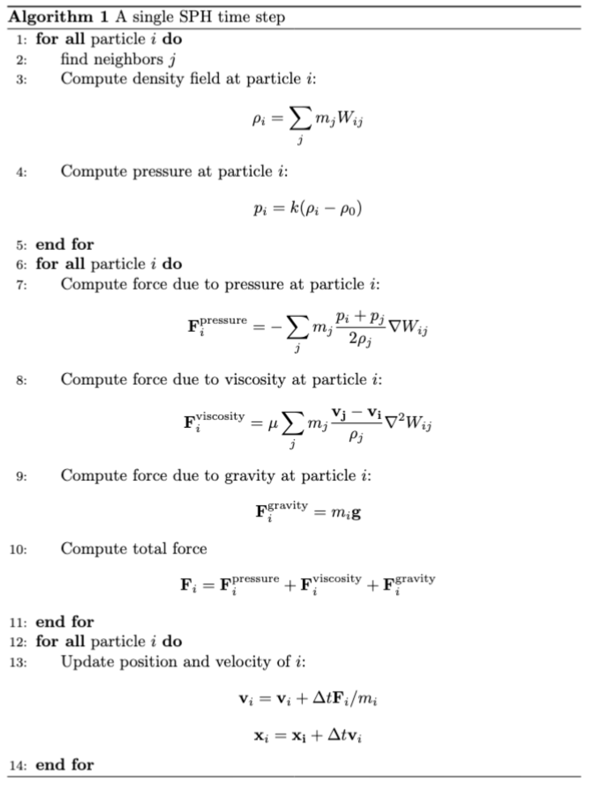

## Title: SPH Fluid Simulation in CUDA

### Summary 
We will implement a smoothed-particle hydrodynamics (SPH) fluid simulation in CUDA. We will test our implementation’s performance using multiple different spatial data structures to observe their impact on overall performance.

### Background
Simulating the physical behavior of fluids in real-time has a wide variety of use cases, though the complex interplay of various physical phenomena that occurs inside a real dynamic fluid makes the problem computationally difficult. One powerful technique that has emerged in this field is smoothed-particle hydrodynamics (SPH). In this model, the fluid is represented as a massive collection of free-flowing particles, and the forces exerted on a given particle are approximated as a combination of the forces exerted by the particles in a nearby neighborhood defined by some radially-symmetric smoothing kernel. Specifically, we will consider the two main forces that govern fluid dynamics: pressure and viscosity. On a given time step, SPH involves the following set of calculations

<!--  -->

In the above pseudocode Wij represents the smoothing kernel. There are various options for the specific function describing the kernel, but for the purpose of SPH simulation they all adopt a finite support h, meaning that they output 0 whenever the inputted pair of particles i and j are farther than h units apart.

Relatedly, of major importance in the above algorithm is the first step: namely, the search for neighbors of a given particle. Because of the properties of the kernel described above, we know that only a subset of particles will factor into this computation. However, a brute-force search over every particle to check whether it is within distance h of the current particle is obviously computationally infeasible. Thus, SPH is made possible by the use of certain spatial data structures which accelerate this neighbor search. Most commonly, a uniform grid partitioning the ambient 3D space into cubes of dimension h is used–this way, only 27 cubes (or cells) in the grid need to be queried to collect the relevant neighbors of a single particle. 

This application benefits from parallelism in two ways: for one, the force calculations and particle updates exhibit effectively no data dependencies, suggesting that these updates can be performed in parallel every time step. Furthermore, note that in order to get accurate results in the simulation the spatial data structure used in the neighbor search must be re-built at the beginning of every timestep, as the particles will have changed positions from the previous time step. Finding ways to build the data structure in parallel thus promises to give a large performance boost on top of parallelizing across the particles. We intend to optimize our simulation using both of these forms of parallelization. 

### Challenge
Write-conflicts (race conditions) make naively parallelizing the grid data structure construction step impossible. Concurrency control such as locks can eliminate these race conditions, but this introduces synchronization stalls which hinder performance during this construction step. The challenge is thus designing and implementing methods for parallel creation of the spatial data structure which minimize the need for this kind of synchronization and thus deliver improved performance. 

A related challenge lies in the access characteristics of the neighbor search. Namely, for each particle, the particle objects of its neighbors must be accessed in order to get quantities needed for the force computations such as mass, position, and velocity during a single time step. Each neighbor thus necessitates a memory access, and so in the event of a non-trivial number of neighbors the added challenge of reducing data stalls is introduced. Further consider that at a given timestep some grid cells might not contain any particles, and yet the uniform grid data structure still requires those cells to have a portion of memory allocated for them. Ideally, there could instead be some more compact representation grid, containing only those cells which are actually occupied. We intend to implement spatial data structures which reflect the 3D spatial locality of particles in the memory layout to reduce this memory access overhead while simultaneously minimizing the memory footprint.

### Resources
Development will be done using C++ and CUDA targeting the GPUs in the GHC machines. We intend to write the bulk of the code from scratch, though we plan to refer to the following (publicly available, freely licensed) codebases for details such as choice of constant values, as well as a guideline for implementation of the visualizer component which will be required for us to examine the behavior of our program:

- [CUDA SPH solver (WerenskjoldH)](https://github.com/WerenskjoldH/CUDA-SPH-Solver)
- [SPH Fluid simulator (lijenicol)](https://github.com/lijenicol/SPH-Fluid-Simulator?tab=readme-ov-file)

Additionally, we have already consulted and plan to further consult the following papers to guide our development and to ensure a correct SPH implementation

1. Müller, Matthias et al. “Particle-based fluid simulation for interactive applications.” Symposium on Computer Animation (2003).
2. Ihmsen, Markus et al. “SPH Fluids in Computer Graphics.” Eurographics (2014).
3. Koschier, Dan et al. “Smoothed Particle Hydrodynamics Techniques for the Physics Based Simulation of Fluids and Solids.” Eurographics (2020).
4. Kalojanov, Javor and P. Slusallek. “A parallel algorithm for construction of uniform grids.” Proceedings of the Conference on High Performance Graphics 2009 (2009): n. Pag.
5. Ihmsen, Markus et al. “A Parallel SPH Implementation on Multi‐Core CPUs.” Computer Graphics Forum 30 (2011): n. pag.

### Goals and Deliverables
The main deliverable we plan to achieve is three implementations of a CUDA-based SPH simulator, each using a different spatial data structure for neighbor search:
1) Basic uniform grid
2) Index sort
3) Compact hashing

We intend for at least one of the latter two versions of the simulator to outperform the one using a basic uniform grid, as the main goal of these other implementations is to address the issues mentioned above (namely parallel construction and memory efficiency) present in the basic uniform grid. Note that we will measure performance by timing the simulation for a fixed number of timesteps and particles and comparing these absolute times across different implementations. Beyond the actual code, we would like to analyze and compare the performance of each implementation by collecting data using the Nsight compute profiler. In this analysis we hope to compare the relative speedup of the two optimized implementations over the base implementation and identify the reasons why these versions perform the way they do.

Should we get ahead of schedule, we would like to implement a fourth spatial data structure based on the Z-index sort described in reference source [5] above. This technique is designed to optimize cache-hits during the neighbor search by laying out the particles in memory according to a recursive block structure. In this case, we would incorporate the performance of this version into our analysis, comparing it to the others as well. Moreover, with additional time we would like to explore some of the extensions that can be applied to SPH to make the simulation more realistic, such as the incorporation of surface tension forces and boundary conditions. While likely not directly contributing to our analysis of the parallelism, this would make our simulator more capable and accurate.

If alternatively we fall behind our schedule, we will instead just attempt to implement one of the above optimized versions instead of both. In this case we hope to still perform a comparative analysis of these two simulators.

### Platform choice
We have decided to use CUDA for this project given that SPH is by nature a highly data-parallel application with a large amount of input data. CUDA provides a general purpose interface for programming GPU’s, which are designed for massively data-parallel computations. From earlier in this class, we also have previous experience using CUDA and the Nsight Compute profiler, and so we will have more bandwidth to focus on the actual content of the project rather than expending effort learning new tools.

### Schedule
__Week 1__: _March 24 - March 31_
- Finalize and submit proposal
- Choose parameter values and kernel functions
- Begin scaffolding code 

__Week 2__: _March 31 - April 7_
- Finish code infrastructure, particularly visualizer
- Ideally, we will be able to visualize moving particles at this phase (though not expecting the SPH to have been implemented)

__Week 3__: _April 7 - April 14_
- Implement SPH using basic uniform grid

__Week 4__: _April 14 - April 21_
- Implement index sort and compact hashing 

__Week 5__: _April 21 - April 29_
- Complete analysis, work on stretch goals

> To view the proposal as PDF, please [follow this link](https://drive.google.com/file/d/1-BI2s8zyMB448TeCOZsRFptyR83FTEmQ/view?usp=sharing)
