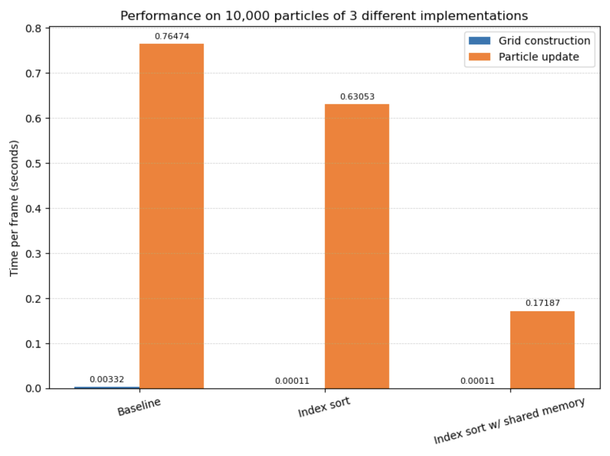

## Title: SPH Fluid Simulation in CUDA

### Baseline
So far we have successfully implemented the baseline SPH simulation in CUDA along with a visualizer using OpenGL which renders the position of the particles after each timestep. The basic idea is to divide the entire 3-D space into cells, where each cell is a small cube with dimension h, which is a parameter indicating the maximum range within which particles exert forces on each other, and impact the resultant positions of other particles within that range for the next timestep. Each particle is initialized to a position, which is determined by one of the two modes of initialization supported by the simulation – random, in which the positions of the particles are initialized at random within the 3-D space; or grid, where the particles are initialized equally spaced, each particle having the next and previous particle placed within its area of influence (< h). These modes can be specified when invoking the simulation on the command line. Other parameters implemented include the number of particles (-n), and the simulation mode (timed, which involves collecting timing data by running the simulation for a fixed number of frames; and free, which lets the simulation run until manually terminated). The steps below outline the overall flow of the simulation for each timestep:

1. __Build grid__: This step involves building a “neighbor grid”, which is essentially an array of all the cells in the 3-D space, with their indices flattened, to map them into a 1-D array. Each array element is a linked list of the particles which are a part of that cell. This build process is completed in parallel by launching a thread per particle, which updates the linked lists in parallel, by determining the position of their respective particles in space. To achieve thread-safety, the linked lists follow __lock-free insertions__ using the atomic compare-and-swap (_atomicCAS()_) primitive in CUDA.
2. __SPH update__: After the grid is built, we now have the position information for all the particles, which is then used to consider the impact of inter-particle forces and pressure and density on the positions of the particles for the next timestep. The idea is to consider the impact of particles in the engulfing 26 cells for any given cell in 3-D space. This update step is done using 3 kernels, two of which update the forces, density and pressure, and one does the actual position updates for the particles based on the computed values. This requires linked list traversals, and can therefore cause the simulation to slow down when the particles come close together, as that directly influences the length of these linked lists.
3. __Reset grid__: The final step is to reset the grid, as in reset all linked list heads to NULL. Note that the linked list nodes are just the particle instances from the particles array in global memory, so these nodes don’t need to be freed. For performance reasons, this step is performed in parallel as well, using threads equal to the number of cells in the 3-D space.

> Bonus: We have also incorporated mouse controls to allow user interaction with the particles. Mouse clicks within the space in the box causes the particles around the targeted cell to move in respective directions, by giving them a velocity component depending on the cell they belong to, and for the targeted cell, the particles are given a velocity in the z direction (as if pushing them inwards) – this effect is propagated throughout the planes along the z axis.

### Index sort
Additionally, we have implemented the __index sort__ optimization, whereby each time the neighborhood grid is constructed, the global array of particles is sorted according to the id of the grid cell the particle belongs to. We use the sort method provided by the thrust library, which implements a parallel sort. This guarantees spatial locality when iterating over the particles in a single grid cell during the neighborhood search phase. Recall that searching over even a single grid cell in the baseline version meant traversing a pointer-based linked list, which does not provide any locality. As a further optimization, we introduced a shared memory buffer into the neighbor search phase. Now, before updating the particle attributes, each CUDA thread will load its particle into this shared memory buffer. Then during the actual neighbor search, each thread can determine using a simple rule whether or not the neighbor it is currently querying resides in this shared memory buffer or in global memory. In other words, some non-trivial fraction of the neighbors of a given particle now reside in shared memory rather than global memory. 

### Expectations and final presentation
We believe we are on track to meet all our goals presented in the writeup, including the stretch goals. We are ahead of the original schedule, and we believe we will be able to implement the z-index sort optimization as well at least one of the two hashing schemes (likely both). At this point we have been able to introduce our own optimization (using shared memory) beyond those described in the reference sources, and we hope to do more of this to obtain the most ideal performance.

Ideally, we would like to show a speedup graph showing the performance gains across the main implementations against the baseline implementation. We would like to highlight the optimizations, and hopefully also do a brief demonstration using our visualizer for the baseline and the fastest implementation.

### Preliminary results
Using the timed mode of our CLI which runs the simulation for 20 timesteps, we have obtained the following preliminary results using the grid initialization of the fluid.

As expected, the index sort implementation using block-local shared memory buffers performs the best. Moreover, grid construction in the baseline implementation takes the longest due to the sequential nature of the lock-free linked list insertion, whereas grid construction in index sort is fully parallelized. Plain index sort does achieve a noticeable speedup over the baseline implementation, though the greatest speedup comes as a result of shared memory usage, which indicates that the latency incurred from the global memory reads during the neighbor search are the performance bottleneck in implementations not relying on shared memory. We thus intend to look for more ways to make use of shared memory in further versions of our code.

### Revised Schedule
_Apr 16, 2025_
- Implement z-index sort (Andrew)

_Apr 16, 2025 - Apr 21, 2025_
- Implement spatial hashing (Andrew)
- Implement compact hashing (Karan)

_Apr 21, 2025 - Apr 25, 2025_
- Make further CUDA-specific optimisations (Karan)
- Collect experimental results using our timer tool and NCU (Andrew)

_Apr 25, 2025 - April 29, 2025_
- Write report (Andrew + Karan)

> To view the milestone as PDF, please [follow this link](https://drive.google.com/file/d/1rff45rvcyF1p1DJyg6RjyrLrQdg5cGJq/view?usp=sharing)
